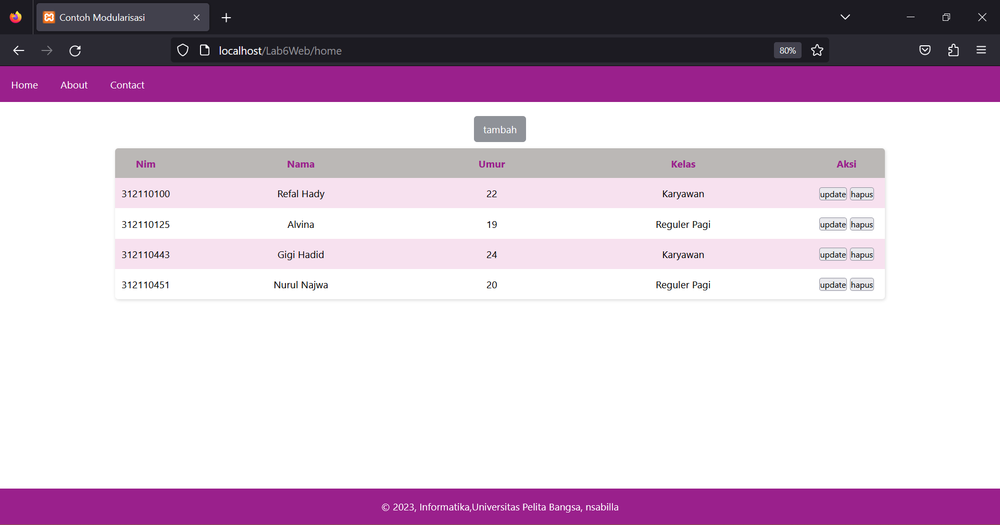
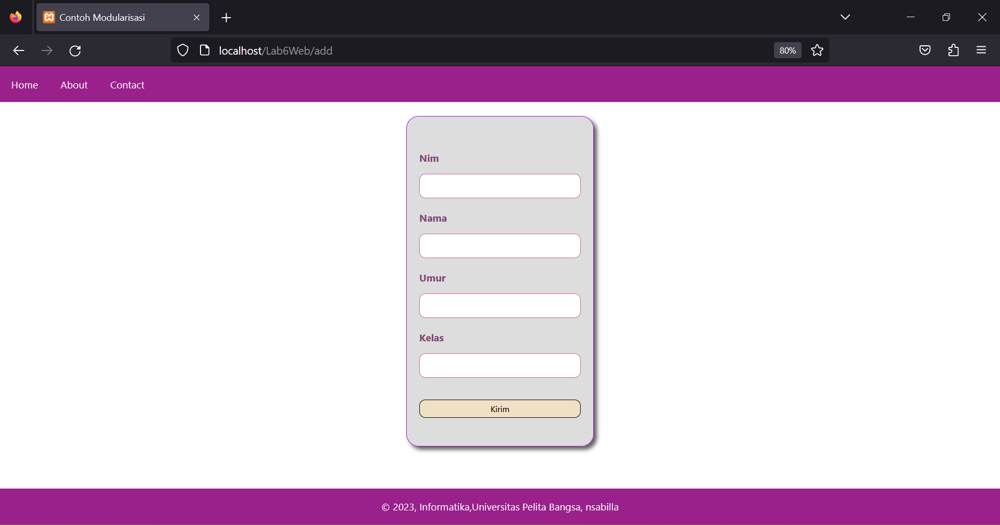
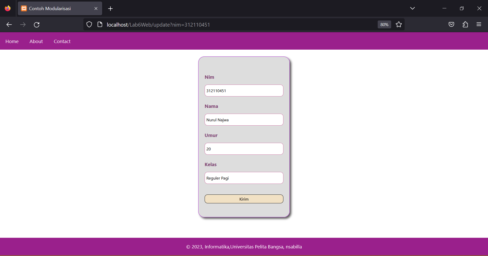
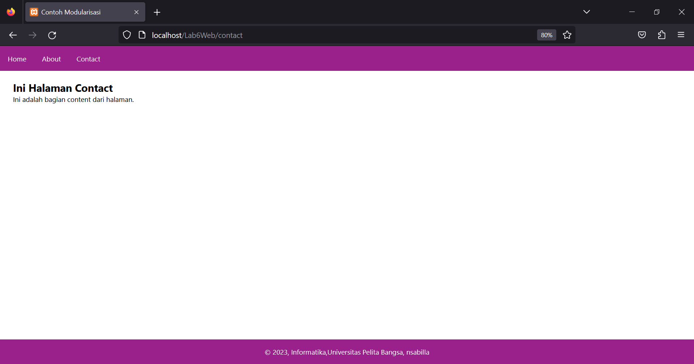

# Praktikum 6: PHP OOP Lanjutan

**
Nama: Nurul Najwa Sabilla
**
**
Kelas: TI.21.A3
**
**
NIM: 312110451
**

## Struktur Folder 

1. Copy file library (class) dari praktikum 5 dan letakkan pada folder class.
2. Folder template yang berisi file header, dan file footer. 
3. Folder module artikel yang berisi CRUD dengan memanfaatkan library database dan form tersbut.
4. File index.php berisi routing aplikasi dan dikombinasikan dengan penggunaan mod_rewrite pada file .htaccess

## HOME

## TAMBAH DATA

## MENGUBAH DATA

## ABOUT

## CONTACT

